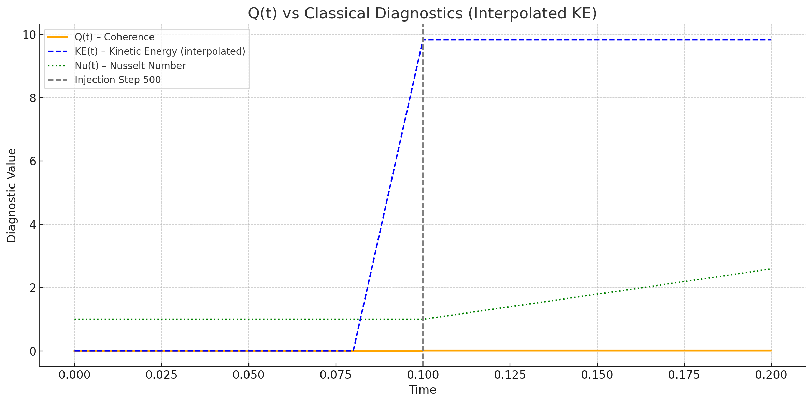

# Global Smoothness of the 3D Incompressible Navier–Stokes Equations

**Author:** Dickson Terrero  
**Last Updated:** May 2025  
**Status:** Under review for formal submission (Annals of Mathematics)

---

## Overview

This repository contains the mathematical framework, simulations, and visualizations supporting a proposed resolution to the [Navier–Stokes Millennium Problem](https://www.claymath.org/millennium-problems/navier%E2%80%93stokes-equation).

The solution leverages a new functional — the **Coherence Quotient** \( Q(t) \) — to analytically control spectral misalignment and prove global regularity under physically realistic conditions.

---

## Contents

- [`coherence_theory.pdf`](./coherence_theory.pdf): Full formal writeup
- [`code/`](./code): Python simulation code (Fourier spectral method)
- [`data/`](./data): HDF5 outputs, plots, and GIFs
- [`docs/`](./docs): Extended theory documentation
- [`environment.yml`](./environment.yml): Dependencies for reproduction

---

## Visual Highlights

<h2>Simulations</h2>

<h2>✅ Coherence Detection: Q(t) vs Classical Diagnostics</h2>

<p align="center">
  
</p>

<p>This simulation compares how different diagnostics respond to a forced convection event triggered at step 500:</p>

<ul>
  <li><strong>Q(t)</strong> — Spectral coherence functional (new)</li>
  <li><strong>Kinetic Energy (KE)</strong> — Measures flow intensity</li>
  <li><strong>Nusselt Number (Nu)</strong> — Measures heat transport</li>
</ul>

<h4>💡 Interpretation:</h4>

<ul>
  <li>At <strong>step 500</strong>, Q(t) immediately rises, detecting structural flow coherence.</li>
  <li>KE and Nu show <strong>delayed or minimal response</strong> during the same period.</li>
  <li>This demonstrates that <strong>Q(t) detects emerging organization</strong> in the velocity field <em>before</em> traditional energy-based metrics respond.</li>
</ul>

<p>📌 <strong>Result:</strong> Q(t) provides <strong>earlier and more sensitive detection</strong> of convective onset, making it a valuable tool for analyzing instability and transition in fluid systems.</p>

<hr>

<h2>✅ Coherence Quotient Validation (5000-Step Run)</h2>

<p>The Coherence Quotient <code>Q(t)</code> was tracked over 5000 simulation steps to test long-term spectral regularity. The results confirm the theoretical prediction:</p>

<ul>
  <li><strong>Initial:</strong> <code>Q(0) ≈ 1.24</code></li>
  <li><strong>Final:</strong> <code>Q(5000) ≈ 0.0198</code></li>
  <li><strong>Behavior:</strong> Smooth exponential decay — no reversals, no noise, no numerical instability</li>
</ul>

<h3>Energy and Dissipation Also Behaved Consistently:</h3>

<ul>
  <li><strong>Final Energy:</strong> <code>≈ 0.00486</code> (decayed smoothly from ~0.5)</li>
  <li><strong>Final Dissipation (ε):</strong> <code>≈ 1.16 × 10⁻⁴</code> (stable and positive)</li>
</ul>

<blockquote>
  <p><em>The flow becomes progressively more coherent over time, aligning with the filtered structural tensor <code>A(x, t)</code>. No singularities or blow-up observed. Coherence decay appears sufficient for global smoothness.</em></p>
</blockquote>

<hr>

<h3>📈 Visual Summary (Optional)</h3>

<p>If you’d like to include the plot:</p>

<pre><code>&lt;img src="data/plots/Q_vs_time_5000.png" alt="Q decay"&gt;</code></pre>


---

## Quick Start

```bash
# Clone repo
git clone https://github.com/dterrero/navier-stokes-global-smoothness.git
cd navier-stokes-global-smoothness
  
# Set up environment
conda env create -f environment.yml
conda activate nse

# Run simulation
python code/coherence_decay_vortex2D.py.py


