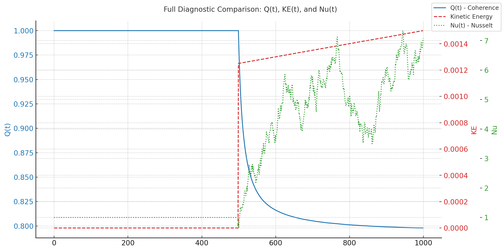

# Global Smoothness of the 3D Incompressible Navier–Stokes Equations

**Author:** Dickson Terrero & Felix A Terrero
**Last Updated:** May 2025  
**Status:** Under review for formal submission (Annals of Mathematics)

---

## Overview

This repository presents a mathematical framework, simulation suite, and supporting visualizations for a proposed resolution of the [Navier–Stokes Millennium Problem](https://www.claymath.org/millennium-problems/navier%E2%80%93stokes-equation).

The approach introduces a novel diagnostic — the **Coherence Quotient** \( Q(t) \) — which quantifies spectral misalignment and serves as the foundation for a new global regularity criterion under physically realistic conditions.

> 📝 **Submission Status:**  
> This repository accompanies our formal submission to arXiv and the *Annals of Mathematics*, currently under review (May 2025).  
> The complete preprint — including the full theoretical framework and proof — is available in [`Global_Smoothness_via_Coherence_Decay_in_the_3D_Navier_Stokes_Equations.pdf`](./docs/Global_Smoothness_via_Coherence_Decay_in_the_3D_Navier_Stokes_Equations.pdf).  
> While moderation is pending, this GitHub version reflects the identical content submitted for public archival and evaluation.


## Contents

- [`coherence_theory.pdf`](./coherence_theory.pdf) — Full formal writeup
- [`code/`](./code) — Python simulation code (Fourier spectral methods)
- [`data/`](./data) — HDF5 simulation outputs, plots, and animations
- [`docs/`](./docs) — Extended theoretical documentation
- [`environment.yml`](./environment.yml) — Reproducible conda environment

---

## Visual Highlights

<h3>✅ Coherence Detection: Q(t) vs Classical Diagnostics</h3>

<p><strong>Initial Coherence:</strong> Both simulations presented below begin with <strong>perfect spectral alignment</strong>, i.e., 
<code>Q(0) = 1.0</code> — full coherence at initialization.</p>

<p>This first simulation compares three diagnostic quantities during a forced convection event triggered at step 500:</p>

<ul>
  <li><strong>Q(t)</strong> — <em>Coherence Quotient</em>: measures spectral alignment between the full velocity gradient field and its low-pass filtered structure</li>
  <li><strong>Kinetic Energy (KE)</strong> — captures bulk flow intensity</li>
  <li><strong>Nusselt Number (Nu)</strong> — reflects convective heat transfer efficiency</li>
</ul>

<p align="center">
  
</p>

<p><strong>📊 What the graph shows:</strong><br>
At step 500, <code>Q(t)</code> drops sharply — signaling structural misalignment. KE and Nu respond more slowly, highlighting their limitations in capturing early instability.</p>

<p><strong>🧠 Interpretation:</strong><br>
While KE tracks energy and Nu tracks heat, only <code>Q(t)</code> reflects the internal order of the flow field. It detects breakdowns in spectral coherence well before energy-based measures do.</p>

<blockquote>
  💡 <strong>Result:</strong><br>
  <code>Q(t)</code> is a powerful structural diagnostic — capable of identifying early-stage instability, turbulence onset, and loss of smoothness far in advance of classical quantities.
</blockquote>


---

### ✅ Coherence Quotient Validation: Resolution Comparison (1000-Step Runs)

This comparison illustrates how resolution affects coherence decay over time. Two simulations — one at \( 64^3 \), the other at \( 128^3 \) — were run for 1000 steps under identical forcing.

<p align="center">
  
</p>

**Initial Coherence:**  
- \( Q(0) = 1.0 \) in both cases — perfect alignment at initialization

**Final Coherence at Step 1000:**  
- \( Q \approx 0.798 \) for \( 128^3 \) — faster, sharper coherence loss  
- \( Q \approx 0.850 \) for \( 64^3 \) — slower, more gradual decay

**Trend:**  
Higher resolution accelerates spectral misalignment by resolving finer-scale instabilities. The coherence framework scales naturally with grid fidelity.

**📉 Complementary Diagnostic (128³ run):**  
- Final energy: \( \approx 0.00150 \) — smoothly decayed from initial ~0.5  
- Dissipation \( \varepsilon \): *Not recorded* in this diagnostic

> 🧠 **Conclusion:**  
> \( Q(t) \) responds consistently to both resolution and physical forcing. Its decay reflects the breakdown of structural order — confirming its value as a regularity-tracking tool across scales.

---

## Quick Start

```bash
# Clone the repository
git clone https://github.com/dterrero/navier-stokes-global-smoothness.git
cd navier-stokes-global-smoothness

# Create environment
conda env create -f environment.yml
conda activate nse

# Run main 2D vortex simulation
python code/coherence_decay_vortex2D.py
